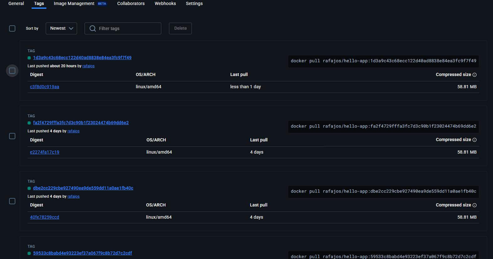
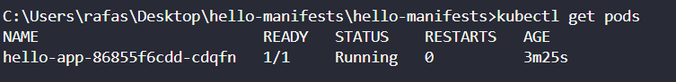
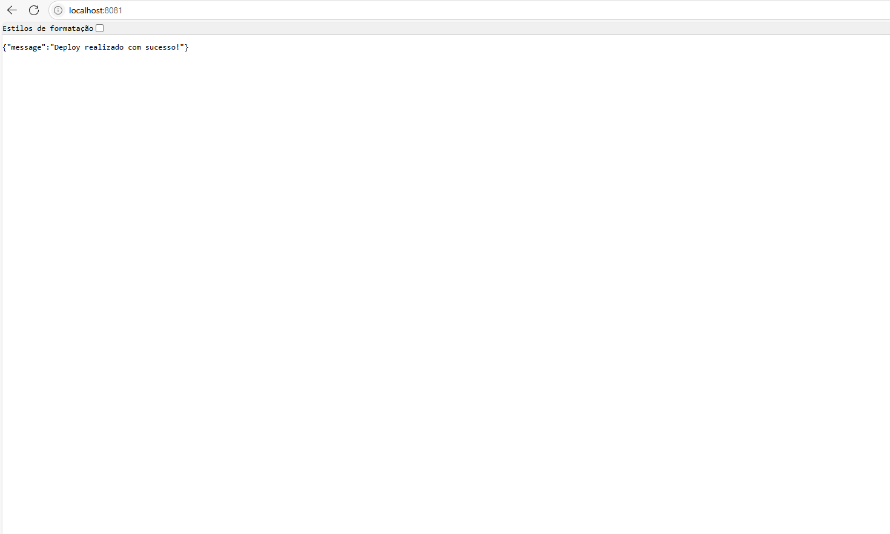

# 🚀 Projeto CI/CD com GitHub Actions, Docker Hub e ArgoCD

## 🧠 Objetivo

Automatizar o ciclo completo de desenvolvimento, build, deploy e execução de uma aplicação FastAPI simples, utilizando:

- **GitHub Actions** para CI/CD
- **Docker Hub** como container registry
- **ArgoCD** para entrega contínua em Kubernetes local via Rancher Desktop

---

## 🛠️ Tecnologias Utilizadas

- Python 3.11 + FastAPI
- Docker
- GitHub Actions
- Docker Hub
- Kubernetes (Rancher Desktop)
- ArgoCD
- GitOps

---

## 📂 Estrutura do Projeto

### 1. Repositório da aplicação

Contém:

- `main.py`: aplicação FastAPI
- `Dockerfile`: imagem da aplicação
- `.github/workflows/deploy.yml`: pipeline CI/CD

### 2. Repositório de manifestos

Contém:

- `deployment.yaml`: define o pod e imagem
- `service.yaml`: expõe a aplicação via ClusterIP

---

## 🧪 Etapas Realizadas

### ✅ Etapa 1: Criação da aplicação FastAPI

```python
from fastapi import FastAPI

app = FastAPI()

@app.get("/")
async def root():
    return {"message": "Deploy feito com sucesso!"}
```
### ✅ Etapa 2: Criar o GitHub Actions (CI/CD) Criado workflow para:

- Build da imagem Docker

- Push para Docker Hub



- Pull Request automático no repositório de manifestos

- Segredos configurados no GitHub:

- DOCKER_USERNAME

- DOCKER_PASSWORD

- SSH_PRIVATE_KEY

### ✅ Etapa 3: Repositório Git com os manifestos do ArgoCD Criado repositório hello-manifests.

Inclui:

- deployment.yaml com containerPort: 8080

- service.yaml com targetPort: 8080

### ✅ Etapa 4: Criar o App no ArgoCD:

- Aplicação criada na interface do ArgoCD

- Repositório de manifestos vinculado

- Sincronização automática ativada


### ✅ Etapa 5: Acessar e testar a aplicação localmente Port-forward para acessar a aplicação:

```bash
kubectl port-forward svc/hello-app 8081:8080
```
- Com tudo funcionando temos o po rodando:



- e a aplicacao acessada via port-forward:



